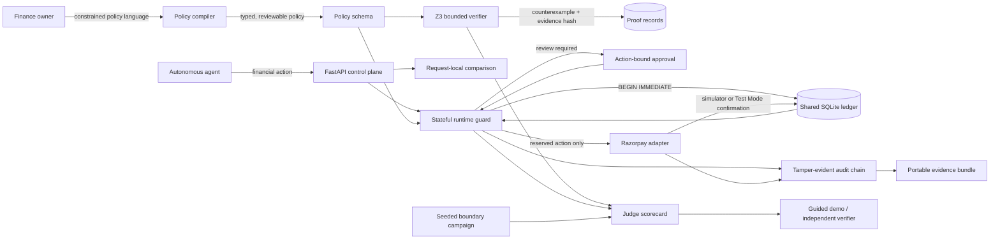
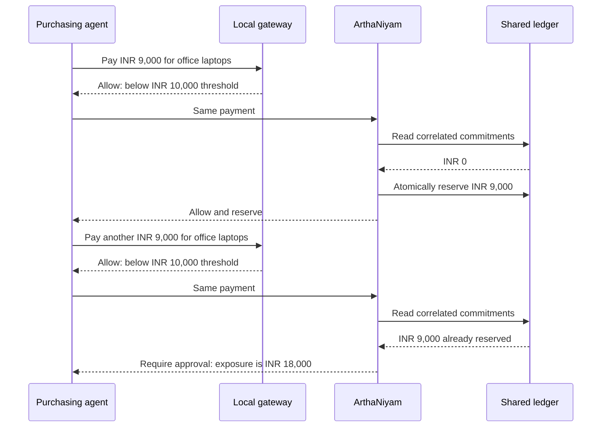

# ArthaNiyam architecture

## System view

The language model, when enabled, proposes a typed policy candidate. It never
authorizes payments. Deterministic schema validation, the solver, and the
stateful runtime guard remain the enforcement boundary.

## Why a stateless gateway is insufficient

An `if` statement can validate the current request. ArthaNiyam evaluates the
current request against durable commitments, delegated authority, prior
invoices, approvals, refunds, and correlated intent.

## Components and guarantees

| Component | Responsibility | Demonstrated guarantee |
|---|---|---|
| Policy compiler | Converts constrained prose into typed candidate policy | Ambiguities remain reviewable and cannot directly authorize money |
| Z3 verifier | Searches bounded action sequences | Produces a minimal split-payment counterexample and honest bound statement |
| Runtime guard | Makes stateful authorization decisions | Applies budget, correlation, invoice, delegation, approval, and refund invariants |
| Shared ledger | Coordinates reservations | Serializes final admission across independently locked runtime instances |
| Approval binding | Represents human authorization | Binds approval to exact policy version and action contents; consumes it after use |
| Razorpay adapter | Executes approved reservations | Supports offline simulation and Razorpay Test Mode; rejects live keys |
| Audit chain | Records decisions and transitions | Detects changed content, broken links, missing events, and deleted tails |
| Evaluation system | Measures safety and availability | Runs attacks, benign controls, boundary generation, and concurrency bursts |
| Evidence verifier | Validates exported artifacts | Recomputes hashes without trusting the running API |

## Trust boundaries

- All financial values are integers in paise.
- The reference compiler and simulator work completely offline.
- OpenAI model output is treated as untrusted policy input.
- Provider confirmation is trusted only after server-side verification.
- Interactive approvals, delegation administration, and refunds are simulator
  demonstrations until authenticated operator identity is integrated.
- SQLite coordinates instances sharing one database on one host. Multi-host
  consensus and failover are outside the prototype.
- Evaluation metrics describe synthetic benchmark cases, not production fraud
  rates.

## Production scaling path

The policy and evidence contracts are storage-independent. A production system
would replace SQLite with a transactional database such as PostgreSQL, use row
or advisory locks for policy-level admission, place runtime instances behind a
load balancer, externalize audit checkpoints, and connect approvals to an
authenticated identity provider. None of those changes require financial
authorization to be delegated to a language model.
