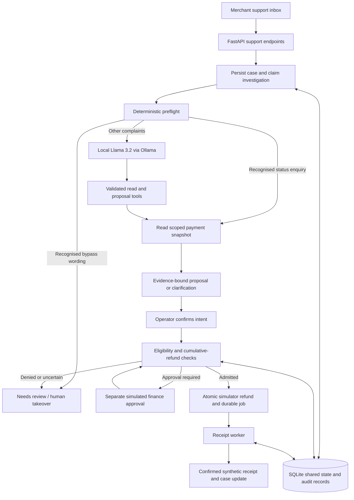

# Merchant support architecture

## Boundaries

- Customer text and model output are untrusted. Five named tools are available; none executes a refund, edits policy or grants finance approval.
- The operator selects payment and amount. Both evidence tools must run before a proposal; its fingerprint must match the scoped snapshot.
- Inference runs outside database transactions. Claims, changed evidence, follow-ups and human takeover govern acceptance of late results.
- Confirmation revalidates proposals. Server checks account for captures, prior/pending refunds and cumulative approval limits. Transactions and idempotency protect local concurrent instances.
- A receipt worker simulates confirmation. Accepted refunds remain pending until a synthetic receipt is recorded.

## Runtime

Python/FastAPI, Pydantic, SQLite, vanilla HTML/CSS/JavaScript and Ollama's loopback chat API. OpenAI is optional and explicitly selected. Earlier Z3/control-plane demonstrations remain at `/labs`; see [their architecture](architecture.md).

## Proposed scale-up

The current app is local, single-merchant and unauthenticated. Production needs authenticated tenant scope, trusted roles, a transactional production database, queued workers, provider reconciliation, observability and independent quality evaluation. These are planned components, not deployed capabilities.
